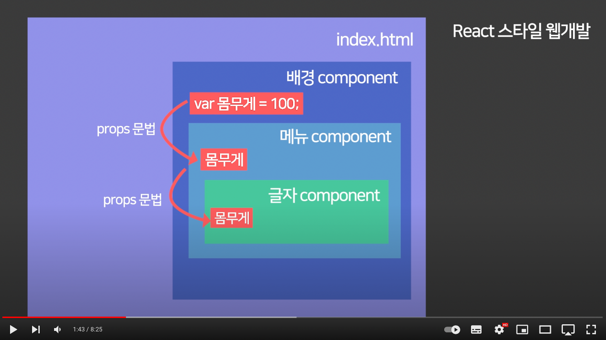

# 리액트 코드리뷰

## 프로젝트 시작
```
$ npx create-react-app {프로젝트명}
```

CRA(Create-React-App)이란?
CRA는 페이스북에서 만든 react.js를 처음 쉽게 빠르게 사용할수 있도록 만든 boilerplate이다.\
boilerplate는 쉽게 말해서 프론트 쪽의 초기 환경 설정을 및 개발을 돕기 위한 템플릿이라고 생각하면된다.

npm 이 아닌 npx 로 설치해야하는 이유\
npm으로 설치할 경우 CRA에 포함된 수 많은 의존성 라이브러리들이 컴퓨터에 계속 남아있게되고, 버전 업뎃에 따라
변경된 사항이 있으면, 글로벌 설치된 패키지를 지우고 다시 설치를 해야하는 이슈가 생긴다.\
npx로 설치하게되면, CRA패키지를 잠깐 다운받고, CRA 프로젝트를 생성 후, 다시 패키지를 삭제한다.
이러한 방식으로 PC에 CRA의 무거운 패키지들을 남기지 않게 되고 항상 최신 버전의 CRA를 사용할 수 있다.

cra에 대해서 좀 더 알고 싶다면?\
https://velog.io/@rlaqltmxm/create-react-app-%EC%82%B4%ED%8E%B4%EB%B3%B4%EA%B8%B0

```
"react": "^18.2.0",
"react-dom": "^18.2.0",
"react-scripts": "5.0.1",
```

### ReactDOM
```
import React from "react";
import ReactDOM from "react-dom";

ReactDOM.render(
    document.getElementById("root")
);
```
ReactDom은 웹의 인터페이스이다. 실제 html 요소를 화면에 불러오는 역할을 한다.
ReactDom은 브라우저의 일부인 Real DOM 을 다룬다. 그래서 ReactDom은 유저가 보는 화면에 무슨 내용을 띄울지 정한다.
ReactDom은 현 state와 전 state의 차이점을 받고, RealDom을 조정한다.

### react-scripts
CRA에서 사용하는 스크립트 및 구성이 포함되어있다. 웹앱의 구동, 빌드 등을 이 라이브러리를 사용하여 진행하고 있다.
```
"scripts": {
    "start": "react-scripts start",
    "build": "react-scripts build",
    "test": "react-scripts test",
    "eject": "react-scripts eject"
 },
```
react-scripts의 내부를 살펴보면 webpack과 같은 모듈 번들러가 포함되어있는것을 확인할 수 있다.\
scripts의 start 와 build는 webpack을 이용하여 빌드되고 있고, test는 테스트 라이브러리인 jest와 연결되어 있다.\
eject는 기존의 하나로 묶여있던 webpack, babel 등을 꺼내어 커스터마이징할 때 사용된다고 한다. 이는 한번 실행이 되면 되돌릴 수 없으니
사용에 신중해야한다. 이럴경우에는 cra보다는 직접 환경세팅을 하는것이 나으다고 한다.

## 리덕스
상태관리라이브러리. 
컴포넌트 상태관리 로직들을 다른 파일들로 분리시켜서 더욱 효율적으로 관리할 수 있으며, 
글로벌 상태관리도 손쉽게 할 수 있다.

### 리덕스를 사용하는 이유

상위 컴포넌트에 변수(=state)를 만들고, 하위 컴포넌트에서 상위 컴포넌트에 있는 변수를 사용하고 싶을 경우 
서로 다른 컴포넌트이기 때문에, props로 받아와서 사용해야한다.\
컴포넌트가 많게 되면, 계속 props로 내려주고, 받아와야하는데, 그렇게 되면 나중에 오류가 생길경우, 디버깅하는데
꽤나 복잡해진다. \
그래서 리덕스라는 상태관리라이브러리를 사용하여, 하나의 state 보관함을 만들어서 props로 일일히 받아오지않고 중앙관리형식으로
state 보관함에서 받아와서 사용하면된다.

[리덕스 장점]
1. 미들웨어 기능이 있다.\
 ㄴ 비동기 작업을 체계적으로 관리할 수있다.
2. 유용한 함수와 Hooks (react redux)\
 ㄴ connect, useSelector, useDispatch, useStore\
 ㄴ 리덕스에서 관리하는 상태를 쉽게 조회, 액션을 디스패치할 수 있다.
3. 기본적인 최적화가 이미 되어있다.\
 ㄴ 예를들어 필요한 상태가 바뀔때에만, 리렌더링 되는 기능이 탑재되어있다.
4. 하나의 커다란 상태\
 ㄴ 하나의 커다란 객체에 넣어서 사용하는게 필수. 매번 context 만드는 수고로움을 덜 수 있다
5. DevTools\
 ㄴ 리덕스는 개발자 도구가 있다.
6. 이미 사용중인 프로젝트가 많다.

[리덕스 언제 써야할까?]
1. 프로젝트 규모가 클때 (작은 프로젝트면, contextAPI로도 충분)
2. 비동기 작업을 자주할때 
3. 실무당사자가 리덕스 사용이 편할때(실무자 당사자가 리덕스가 어려우면...어쩔수없지)

[리덕스 사용법]

## 리덕스 키워드

### 액션(Action)
상태의 어떤 변화가 필요할때 액션을 발생시킨다.\
액션 객체는 type 필드를 필수적으로 가지고 있어야하고 그 외의 값들은 개발자 마음대로 넣어줄 수 있다.
```
{
  type: "TOGGLE_VALUE"
}
```
### 액션 생성함수 (Action Creator)
액션 생성함수는, 액션을 만드는 함수입니다. 단순히 파라미터를 받아와서 액션 객체 형태로 만들어 준다.\
액션 생성함수를 만들어서 사용하는 이유는 나중에 컴포넌트에 더욱 쉽게 액션을 발생시키기 위함이다.\
그래서 보통 함수 앞에 export 키워드를 붙여서 다른 파일에 불러와서 사용한다.
```
export function addTodo(data) {
  return {
    type: "ADD_TODO",
    data
  };
}

// 화살표 함수로도 만들 수 있습니다.
export const changeInput = text => ({ 
  type: "CHANGE_INPUT",
  text
});
```
### 리듀서 (Reducer)
변화를 일으키는 함수이다. 리듀서는 state, action 두가지의 파라미터를 받아오는데,
현재의 state와 action을 참조하여 새로운 상태를 반환 하는 함수. 
```
function counter(state, action) {
 switch (action.type) {
  case 'INCREASE':
   return state + 1;
  case 'DECREASE':
   return state - 1;
  default:
   return state;
 }
}
```
### 스토어 (Store)
리덕스에서는 한 애플리케이션당 하나의 스토어를 만들게 된다. 스토어 안에서는 현재의 앱상태와, 리듀서가 들어있고,
추가적으로 몇가지 내장함수들이 있다.

#### 디스패치 (dispatch)
디스패치는 스토어의 내장함수 중 하나. 디스패치는 액션을 발생 시키는 것이라고 이해하면된다. 디스패치라는 함수에는 액션을 파라미터로 전달한다.
그렇게 호출을 하면, 스토어는 리듀서 함수를 실행시켜서 액션을 처리하는 로직이 있다면 액션을 참고하여 새로운 상태를 만들어준다.

#### 구독 (subscribe) (** 이건.. 아직 이해가 안감)
구독은 스토어의 내장함수 중 하나. subscribe 함수는, 함수 형태의 값을 파라미터로 받아온다. subscribe 함수에 특정함수를 전달해주면,
액션이 디스패치되었을 때마다 전달해준 함수가 호출된다.

## 리덕스의 3가지 규칙

### 하나의 애플리케이션엔 하나의 스토어가 있다.
하나의 애플리케이션에선 단 한개의 스토어를 만들어서 사용한다. 여러개의 스토어를 사용하는 것은 권장되지 않는다.
특정 업데이트가 너무 빈번하게 일어나거나 애플리케이션의 특정 부분을 완전히 분리시키게 될 때 여러개의 스토어를 만들 수도 있다. 하지만 그렇게되면,
개발자 도구를 활용하지 못하게된다.

### 상태는 읽기전용이다. 
리액트에서 state를 업뎃하게 될때, setState를 사용하고, 배열을 업뎃할때는 배열 자체에 push를 직접하지 않고, concat 같은 함수를 사용하여,
기존의 배열은 수정하지 않고, 새로운 배열을 만들어서 교체하는 방식으로 업뎃을 한다. 깊은 구조로 되어있는 객체를 업뎃할때도, 기존 객체를 건드리지 않고
Object.assign을 사용하거나, spread 연산자(...)를 사용하여 업뎃한다.

리덕스에서도 마찬가지로, 기존의 상태는 건들이지않고, 새로운 상태를 생성하여 업뎃해주는 방식으로 해주면 나중에 개발자 도구를 통해서 뒤로 돌릴 수도 있고,
앞으로 돌릴수도 있다.

리덕스에서 불변성을 유지하는 이유는 내부적으로 데이터가 변경되는것을 감지하기 위해 shallow equality 검사를 하기 땜이다.
이를 통하여 객체의 변화를 감지할떄 객체의 깊숙한 안쪽까지 비교를 하는 것이 아니라 겉핥기식으로 비교하여 좋은 성능을 유지할 수 있는 것이다.\
불변성을 지켜야만 컴포넌트들이 제대로 리렌더링 된다.

### 변화를 일으키는 함수 리듀서는 순수한 함수여야한다.
리듀서 함수는 이전상태와 액션객체를 파라미터로 받는다.\
이전의 상태는 절대로 변경하지 않고, 변화를 일으킨 새로운 상태 객체를 만들어서 반환한다.\
똑같은 파라미터로 호출된 리듀서 함수는 언제나 똑같은 결과값을 반환해야만 한다.

## 리덕스 미들웨어
주로 비동기 작업을 처리할때 사용한다.
